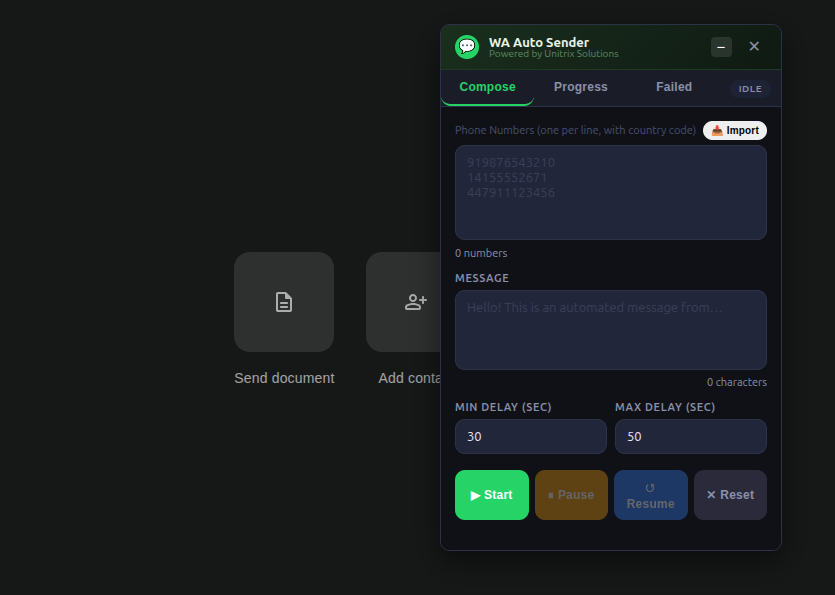
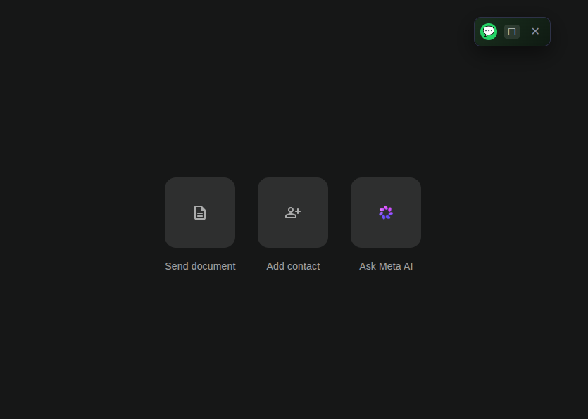
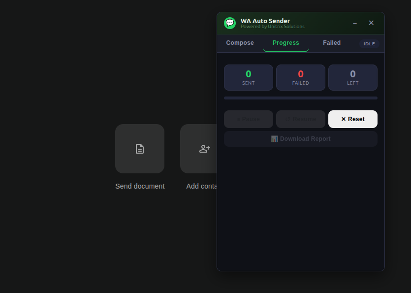
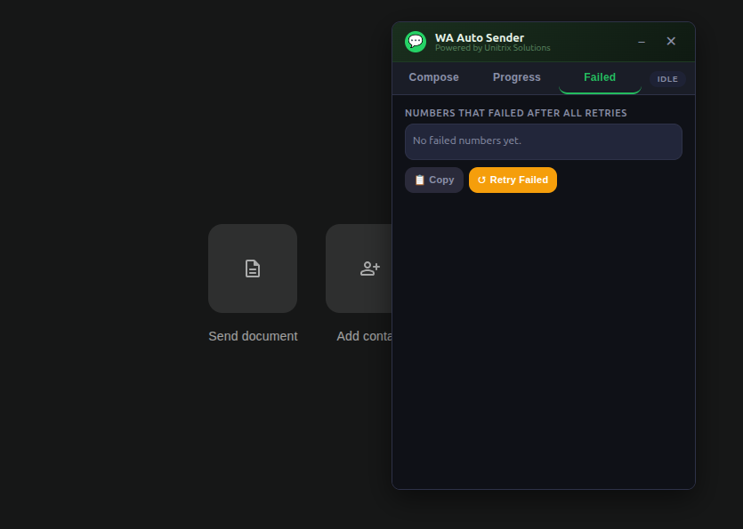

# WhatsApp Auto Sender Pro — v2.0
**A professional Chrome/Edge MV3 extension for reliable bulk WhatsApp messaging. Powered by Unitrix Solutions.**

---

## 🌟 Key Features

### 1. Persistent Floating Widget
Unlike standard extensions that disappear when you click away, WA Auto Sender injects directly into WhatsApp Web.
- **Draggable:** Move it anywhere on your screen.
- **Collapsible:** Shrink it to a tiny bubble to continue working without losing your place.
- **Always on top:** Monitor your campaign progress live while chatting.

### 2. Bulk Import & Smart Validation
- Easily import huge lists of numbers using the new **CSV/TXT Import** feature.
- Built-in E.164 validation ensures you only send to properly formatted numbers, eliminating wasted time on bad data.

### 3. Detailed Progress Tracking & Reports
- Monitor live stats: Sent, Failed, Remaining, and a dynamically calculated ETA.
- **Download CSV Reports:** Instantly generate a full spreadsheet tracking the exact status (Sent/Failed/Pending) of every imported number.

### 4. Per-Contact Retry Logic
- Network blip? Slow load? No problem. The extension intelligently retries failed sends before marking a number as permanently failed.

### 5. Dedicated Failed Tab
- Easily view and copy all failed numbers.
- A single "Retry Failed" button allows you to re-queue them into a new campaign instantly.

---

## 🛠 Installation

1. Open Chrome → `chrome://extensions`
2. Enable **Developer Mode** (top right)
3. Click **Load unpacked**
4. Select the `whatsapp-auto-sender/` folder
5. Open [web.whatsapp.com](https://web.whatsapp.com) and log in.
6. Click the extension icon in your toolbar to launch the floating widget.

---

## 🚀 Usage Guide

1. **Compose Tab**: Import or paste your phone numbers (one per line, with country code e.g. `919876543210`).
2. Write your message and configure the randomized delay range (Min/Max seconds) to avoid spam filters.
3. Click **Start** to begin the campaign.
4. Switch to the **Progress Tab** to watch the magic happen, or collapse the widget to keep working.
5. Download your **CSV Report** at any time.

---

## 🏗 Architecture & Technical Improvements (v2.0)
- **Alarm-Based Scheduling**: Replaced brittle `setTimeout` loops with `chrome.alarms` to survive Service Worker restarts.
- **Content Script Isolation**: The UI is isolated inside a secure `iframe` to prevent WhatsApp style conflicts.
- **Atomic State Updates**: Progress counters are saved perfectly in sync via `chrome.storage.local`.
- **Selector Fallback Chain**: Designed to gracefully degrade if WhatsApp changes its internal DOM structure.

---

## ⚖️ Legal Notice

This extension is for **personal and authorized business use only**. Automated messaging must comply with WhatsApp's Terms of Service. Mass unsolicited messaging violates ToS and may result in account bans. The authors are not responsible for misuse.
